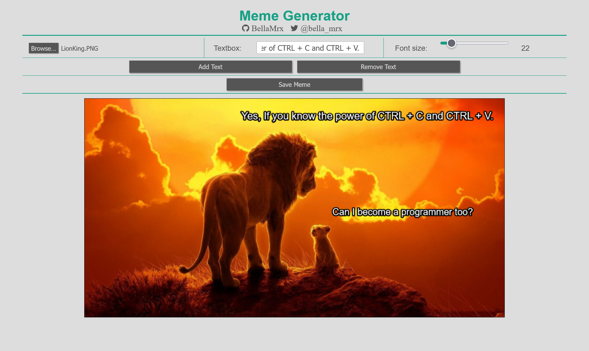

# Meme_Generator

 build with JavaScript (pure JS), HTML, CSS. The code can be found in the "Meme_Generator" folder.

 Preview

 

 Upload image, create text, edit font size, add text (multiple times), move text by drag & drop (click and drag text), remove text (click on the text to be removed, then click "remove")

 Meme

 